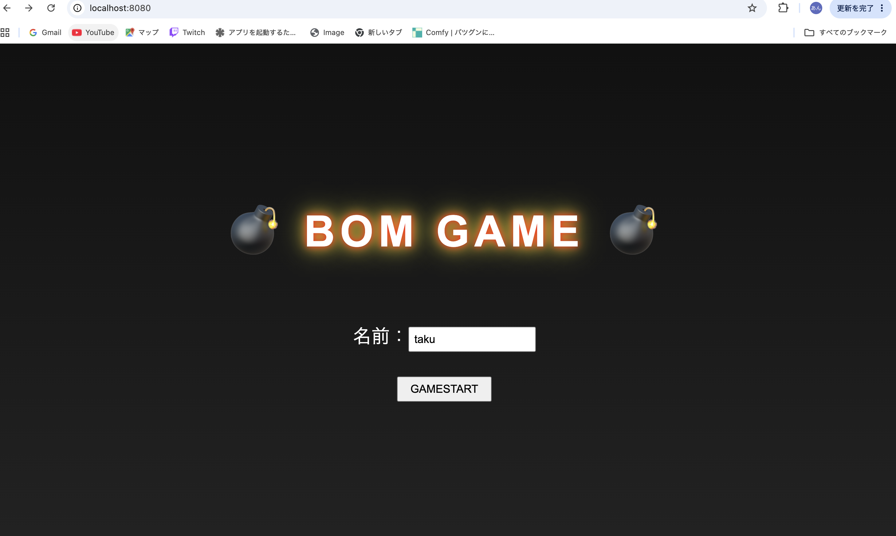
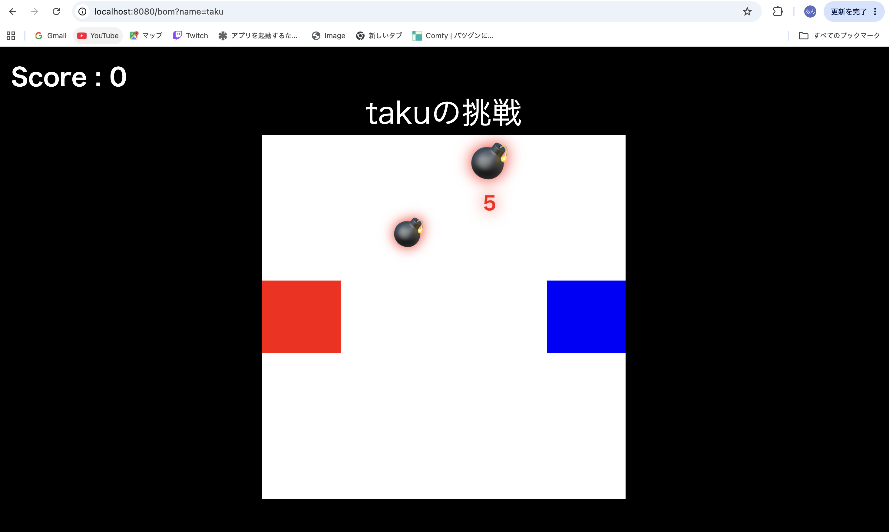
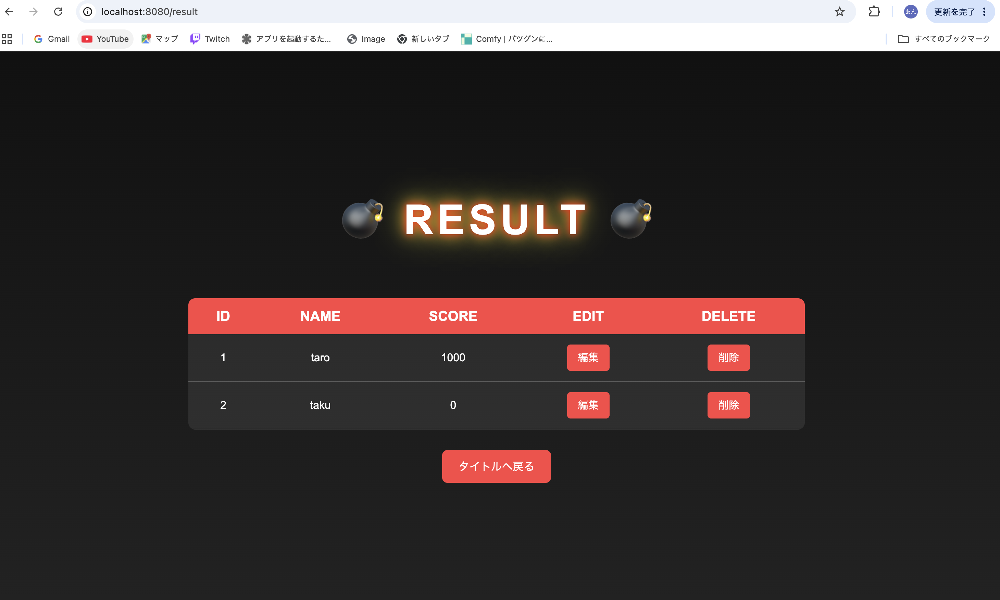
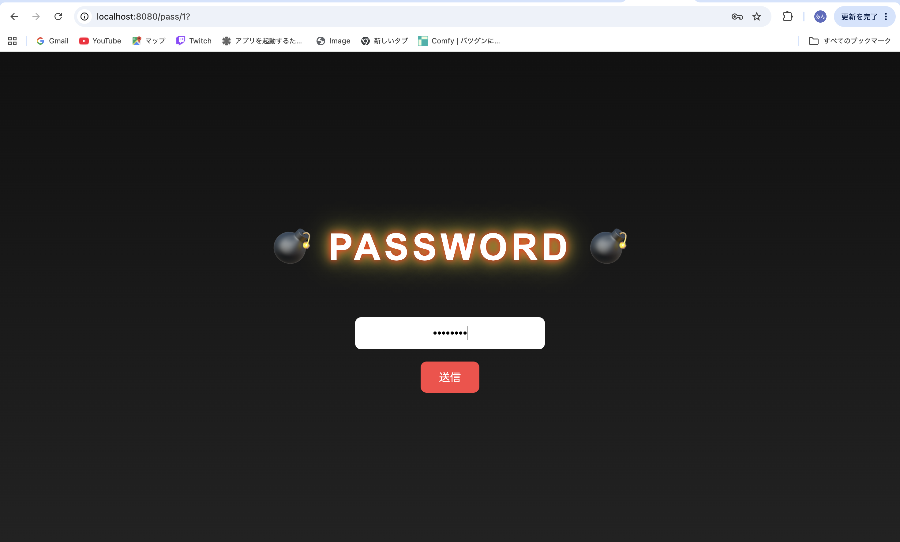
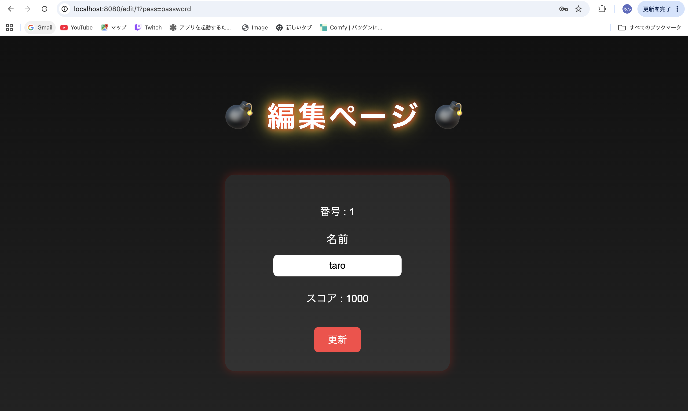

# 💣 Bom Game

ドラッグ＆ドロップで爆弾を解除するブラウザゲームです。

プレイヤーは制限時間内に爆弾を正しいエリアへ運び、スコアを獲得します。時間切れになると爆発しゲームオーバーになります。

---

## 🎮 ゲームルール

* 赤色の爆弾 → 赤側へ運ぶ
* 青色の爆弾 → 青側へ運ぶ
* 正しい場所へ運ぶとスコア獲得
* 時間切れで爆発
* 入れ間違いでも爆発
* 爆発するとゲーム終了

---

## ✨ 実装機能

### 爆弾生成

* 一定間隔で爆弾を生成
* ゲーム進行に応じて出現速度が上昇

### ドラッグ操作

* マウスで爆弾を移動可能
* エリア外への移動制限

### カウントダウン

* 残り5秒で警告表示
* 残り時間を画面表示

### 当たり判定

* 爆弾と判定エリアの衝突判定
* 色ごとの解除判定

### スコア管理

* 解除成功でスコア加算
* スコア表示更新

### ランキング保存

* プレイヤー名とスコアを保存
* Spring Boot + H2 Databaseで管理

### 編集機能

* ランキングデータの編集機能を実装
* 編集画面へのアクセスに簡易パスワード認証を実装

---

## 🛠 使用技術

### フロントエンド

* HTML
* CSS
* JavaScript

### バックエンド

* Java 17
* Spring Boot 4
* Spring JDBC
* Thymeleaf

### データベース

* H2 Database

### ビルドツール

* Gradle

---

## 📚 学習ポイント

このプロジェクトでは以下の内容を学習しました。

* Spring BootによるWebアプリケーション開発
* MVCアーキテクチャ
* JavaScriptによるゲームロジック実装
* DOM操作
* ドラッグ＆ドロップ
* 当たり判定
* タイマー処理
* JDBCを利用したCRUD処理
* データベース連携

---

## 💡 工夫した点

### 編集機能への簡易認証

ランキングやプレイヤー情報の編集機能については、誰でもアクセスできないように簡易的なパスワード認証を実装しました。(pass:password)

編集画面へ遷移する際にパスワード入力を要求し、認証成功時のみ編集機能を利用できるようにしています。

これにより、一般ユーザーが誤ってデータを変更することを防止しています。

### ゲーム難易度の調整

ゲーム開始後は爆弾の出現間隔が徐々に短くなるよう実装し、プレイ時間に応じて難易度が上昇するよう工夫しました。

### 視覚的な緊張感の演出

爆弾の残り時間が少なくなるとカウントダウンを表示し、爆発が近いことをプレイヤーへ視覚的に伝える演出を実装しました。

---

## 🚀 起動方法

```bash
git clone https://github.com/komataku1234-cmd/bom_game.git
cd bom_game
./gradlew bootRun
```

起動後、以下へアクセスしてください。

```text
http://localhost:8080
```

---

## 🔮 今後追加したい機能

* ハイスコアランキング
* 難易度選択
* 爆弾種類追加
* 効果音
* BGM
* スマホ対応
* アニメーション強化
* MySQL対応

---

## 📷 スクリーンショット






